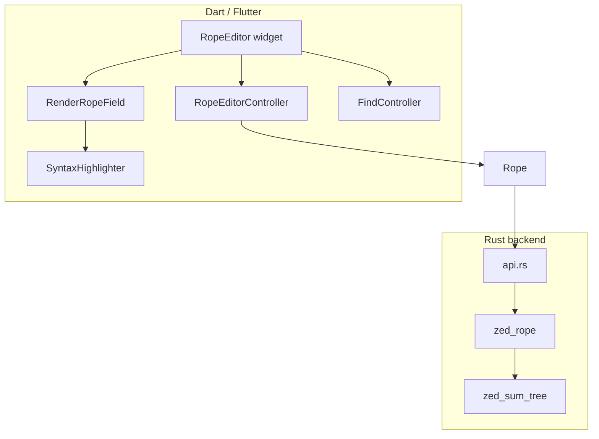

# rope_editor

A high-performance, rope-backed text editor widget for Flutter. Text is stored and mutated in a Rust backend with O(log n) line and offset queries, while the Dart layer handles rendering, input, syntax highlighting, and editing UX.

Built for apps that need a capable code or plain-text editor—not a full IDE—with smooth handling of large files and wide lines.

`rope_editor` grew out of [**CodeForge**](https://pub.dev/packages/code_forge), a Flutter code editor widget, and adopts text-buffer ideas from [**Zed**](https://github.com/zed-industries/zed). See [Acknowledgments](#acknowledgments) for details.

> **Status:** Early development (`0.0.1`). The API is evolving.

## Why rope_editor?

Standard Flutter text fields copy the entire document into Dart strings. That works for short notes, but breaks down for multi-megabyte logs, generated JSON, or source files with very long lines.

`rope_editor` keeps the document in a **Zed-style rope** on the Rust side and crosses the FFI boundary sparingly:

- Edits, search, and metrics run in native code
- Viewport rendering uses **batch APIs** (line offsets, line text, minimap density) to fetch only what is visible
- Large files can be loaded via **streaming file I/O** without materializing the whole buffer in Dart first

## Features

### Editing

- Full text input with selection, clipboard (copy/cut/paste), and platform IME support
- Undo/redo with compound operation merging (`UndoRedoController`)
- Block indent and outdent (`Tab` / `Shift+Tab` on selections)
- Sticky-column vertical cursor navigation
- Dirty-state tracking and document versioning

### Search & replace

- Find bar with live highlight updates as the document changes
- Case-sensitive, regex, and whole-word matching
- Replace current match or replace all
- Search runs in Rust—no full-string copy to Dart

### Syntax highlighting

- Powered by [re_highlight](https://pub.dev/packages/re_highlight)
- Pass a `Mode` (e.g. `langDart`, `langJson`) to `RopeEditor`
- Enhanced Dart highlighting via `langDartEnhanced`
- GitHub light/dark themes re-exported from the package

### Rendering

- Monospace editor with optional line gutter and divider
- Optional line wrapping (horizontal scroll when disabled)
- Paragraph cache pruned to the visible viewport
- Minimap density batch API for companion minimap widgets
- Android selection-handle zoom for precise touch editing

### Low-level text API

The `Rope` class exposes Rust-backed primitives for custom tooling:

| Area | Capabilities |
|------|-------------|
| Metrics | Line count, UTF-16/byte/char lengths, widest line |
| Batch access | Line start offsets, line text ranges, text chunks |
| Search | Full-document and line-range search |
| Indentation | Style detection, per-line indent levels |
| Navigation | Character classes, word boundaries |
| LSP | UTF-16 ↔ byte offset conversion |

See [doc/](doc/) for detailed API guides.

## Architecture



- **zed_rope** — Chunked rope storage for efficient insert/delete
- **zed_sum_tree** — Balanced tree for O(log n) offset and line queries
- **flutter_rust_bridge** — Generated bindings (native FFI on desktop/mobile, WASM on web)
- **Cargokit** — Builds and bundles the native library with the Flutter plugin (non-web targets)

## Requirements

| Dependency | Version |
|------------|---------|
| Flutter | ≥ 3.0 |
| Dart SDK | ≥ 3.3 |
| Rust toolchain | stable via [rustup](https://rustup.rs/) |
| `flutter_rust_bridge_codegen` | 2.12.0 (only when changing `rust/src/api.rs`) |

Supported platforms: **Android, iOS, Linux, macOS, Windows, and Web**.

- **Desktop & mobile** — native library via Cargokit (FFI plugin)
- **Web** — Rust compiled to WASM (`web/pkg/`); see [Web (WASM)](#web-wasm) below

## Getting started

### 1. Add the dependency

```yaml
dependencies:
  rope_editor: ^0.0.1
```

A [Rust toolchain](https://rustup.rs/) is required. On desktop and mobile, the native library is built automatically via Cargokit on first `flutter run` or `flutter build`. On web, compile the WASM module once (see [Web (WASM)](#web-wasm)). See [Building the Rust backend](#building-the-rust-backend) for details.

### 2. Initialize the Rust library

`RustLib.init()` must complete before creating controllers or ropes. Call it once at app startup:

```dart
import 'package:flutter/material.dart';
import 'package:rope_editor/rope_editor.dart';

void main() async {
  WidgetsFlutterBinding.ensureInitialized();
  await RustLib.init();
  runApp(const MyApp());
}
```

### 3. Wire up the editor

```dart
class EditorPage extends StatefulWidget {
  const EditorPage({super.key});

  @override
  State<EditorPage> createState() => _EditorPageState();
}

class _EditorPageState extends State<EditorPage> {
  late final RopeEditorController _controller;
  late final FindController _findController;

  @override
  void initState() {
    super.initState();
    _controller = RopeEditorController();
    _findController = FindController(_controller);
    _controller.text = 'Hello, rope editor!';
  }

  @override
  void dispose() {
    _findController.dispose();
    _controller.dispose();
    super.dispose();
  }

  @override
  Widget build(BuildContext context) {
    return Scaffold(
      body: RopeEditor(
        controller: _controller,
        findController: _findController,
        autoFocus: true,
        language: langDartEnhanced,
        editorTheme: githubDarkTheme,
        textStyle: const TextStyle(
          fontFamily: 'monospace',
          fontSize: 14,
        ),
      ),
    );
  }
}
```

A runnable version lives in [`example/`](example/).

### Loading large files

Avoid assigning huge strings through `controller.text`. Use async file loading instead:

```dart
await controller.loadFromFile('/path/to/large.log');

// Or load only the first N UTF-16 code units (useful for single-line files):
await controller.loadFromFile('/path/to/huge.json', maxChars: 50000);
```

## Configuration

`RopeEditor` accepts several knobs for embedding:

| Parameter | Default | Description |
|-----------|---------|-------------|
| `lineWrap` | `false` | Soft-wrap long lines |
| `enableGutter` | `true` | Show line numbers |
| `enableGutterDivider` | `true` | Vertical rule between gutter and text |
| `tabSpaces` | `4` | Spaces inserted per Tab |
| `language` | `null` | `re_highlight` mode for syntax coloring |
| `editorTheme` | — | Map of scope name → `TextStyle` |
| `finderBuilder` | — | Custom find/replace bar widget |
| `jsonFormatterController` | — | External trigger for JSON pretty-print |
| `verticalScrollController` | auto | Share scroll position with a minimap |
| `showVerticalScrollbar` | `true` | Native scrollbar on the editor |

## Keyboard shortcuts

| Shortcut | Action |
|----------|--------|
| `Ctrl+F` | Open find |
| `Ctrl+Z` / `Ctrl+Y` | Undo / redo |
| `Ctrl+C` / `Ctrl+X` / `Ctrl+V` | Copy / cut / paste |
| `Ctrl+A` | Select all |
| `Tab` / `Shift+Tab` | Indent / outdent selection |
| `Shift+Alt+F` | Pretty-print JSON (when `language` is JSON) |

Arrow keys, Home/End, and Page Up/Down are handled for cursor movement. On macOS, `Cmd` is used where `Ctrl` appears above.

## Using the Rope API directly

For custom panels, diagnostics overlays, or LSP bridges, use `controller.rope` or construct a standalone `Rope`:

```dart
final rope = Rope('line one\nline two\n');

final metrics = rope.getMetrics();
print('${metrics.lineCount} lines, widest: ${metrics.maxLineUtf16Len}');

final offsets = rope.getLineStartOffsetsBatch(0, 10);
final densities = rope.getMinimapDensityBatch([0, 1, 2, 3, 4]);

for (final match in rope.search('pattern', isRegex: true)) {
  print('${match.start}–${match.end}');
}
```

API documentation: [doc/README.md](doc/README.md)

## Development

### Building the Rust backend

The native library lives in [`rust/`](rust/) and is compiled into a platform-specific shared library (`librope_editor.so`, `librope_editor.dylib`, or `rope_editor.dll`) that Dart loads via FFI. [**Cargokit**](cargokit/) wires this into the Flutter plugin build so you rarely need to invoke `cargo` directly.

#### Prerequisites

1. **[rustup](https://rustup.rs/)** with the stable toolchain (`rustc`, `cargo`, and `rustup` on your `PATH`)
2. **`flutter_rust_bridge_codegen`** matching the crate version in `pubspec.yaml` and `rust/Cargo.toml` (currently **2.12.0**):

   ```bash
   cargo install flutter_rust_bridge_codegen --version 2.12.0 --locked
   ```

3. **Platform tooling** for your target:
   - **Linux / Windows / macOS desktop** — standard Rust toolchain only
   - **Android** — Android NDK (installed with the Flutter SDK; check with `flutter doctor`)
   - **iOS / macOS** — Xcode

Cargokit installs missing Rust cross-compilation targets automatically on the first build for a given platform.

#### Web (WASM)

Web does not use Cargokit. Instead, `flutter_rust_bridge` loads a WASM module from `web/pkg/` (`rope_editor.js` + `rope_editor_bg.wasm`). Build it once per app (or after changing `rust/`):

```bash
cd example   # or your app's root, with a web/ folder
flutter_rust_bridge_codegen build-web \
  --dart-root .. \
  --rust-root ../rust \
  --output web \
  --release
```

Then run or build as usual:

```bash
flutter run -d chrome
# or: flutter build web
```

`RustLib.init()` picks the WASM loader automatically on web (see `webPrefix: 'pkg/'` in the generated bridge). Re-run `build-web` after Rust API changes.

#### Automatic build (normal workflow)

You do not need a separate Rust build step for day-to-day Flutter work. Cargokit hooks into the plugin build when you run:

```bash
cd example
flutter run          # or: flutter build <platform>
```

```bash
flutter test         # also triggers a native build
```

The native library is rebuilt when sources under `rust/` change. First run may take a few minutes while dependencies compile.

#### Standalone Rust development

For fast iteration on Rust-only logic without a full Flutter build:

```bash
cd rust
cargo test           # unit tests (e.g. word-boundary tests in api.rs)
cargo build          # debug library in rust/target/debug/
cargo build --release
```

These commands compile and test the crate locally. They do **not** copy artifacts into the Flutter plugin output or regenerate FFI bindings. After changing `rust/src/api.rs`, run the codegen step below and then `flutter test` to verify the full Dart ↔ Rust integration.

#### Regenerate FFI bindings

After changing [`rust/src/api.rs`](rust/src/api.rs) or [`flutter_rust_bridge.yaml`](flutter_rust_bridge.yaml):

```bash
flutter_rust_bridge_codegen generate
flutter pub get
```

Codegen configuration:

| Setting | Value |
|---------|-------|
| `rust_input` | `crate::api` |
| `rust_root` | `rust` |
| `dart_output` | `lib/src/rust` |

Commit both your Rust changes and the generated files under `lib/src/rust/` and `rust/src/frb_generated.rs`.

#### Rust crate layout

```
rust/
  Cargo.toml              # crate manifest (flutter_rust_bridge = 2.12.0)
  src/lib.rs              # crate root
  src/api.rs              # #[frb] FFI surface — add new APIs here
  src/frb_generated.rs      # generated by flutter_rust_bridge_codegen
  src/zed_rope/             # rope implementation
  src/zed_sum_tree/         # offset metrics tree
```

#### Troubleshooting

| Symptom | What to try |
|---------|-------------|
| `RustLib.init()` fails / library not found (native) | Run `flutter test` or `flutter run` once to trigger Cargokit; confirm `rustc` is on `PATH` |
| `RustLib.init()` fails on web | Run `flutter_rust_bridge_codegen build-web` and confirm `web/pkg/rope_editor_bg.wasm` exists |
| Codegen errors or mismatched types | Align versions: `pubspec.yaml`, `rust/Cargo.toml`, and installed `flutter_rust_bridge_codegen` must match |
| Android NDK / linker errors | Run `flutter doctor`; ensure the NDK version in your app's `android/app/build.gradle` is installed |
| Stale native binary after Rust changes | `flutter clean` in the app or example, then rebuild |
| Cross-target build fails | Let Cargokit run once (it installs targets via `rustup`); or manually: `rustup target add <triple>` |

### Run the example

```bash
cd example
flutter run              # desktop or mobile (Cargokit builds native lib on first run)
```

For web, build WASM first (from the `example/` directory):

```bash
flutter_rust_bridge_codegen build-web \
  --dart-root .. \
  --rust-root ../rust \
  --output web \
  --release
flutter run -d chrome
```

### Run tests

```bash
flutter test
```

Tests call `RustLib.init()` in `setUpAll`, so a working Rust build is required.

### Performance profiling

The [`scripts/trace_calls.sh`](scripts/trace_calls.sh) tool analyzes Dart DevTools CPU traces and highlights FFI overhead. See [scripts/AGENTS.md](scripts/AGENTS.md) for usage.

## Project layout

```
lib/
  editor.dart              # RopeEditor widget
  controller.dart          # RopeEditorController (editing + IME)
  editor_field.dart        # Custom render object
  rope.dart                # Dart wrapper around Rust rope
  find_controller.dart     # Find & replace
  undo_redo.dart           # Undo/redo stack
  syntax_highlighter.dart  # Highlighting pipeline
rust/
  src/api.rs               # FFI surface
  src/zed_rope/            # Rope implementation
  src/zed_sum_tree/        # Offset metrics tree
doc/                       # Low-level API guides
example/                   # Minimal integration demo
```

## Related documentation

- [API overview](doc/README.md)
- [Batch operations](doc/batch-operations.md)
- [Search](doc/search.md)
- [Word navigation](doc/word-navigation.md)
- [LSP offset compatibility](doc/lsp-compatibility.md)

## Acknowledgments

### CodeForge

[CodeForge](https://pub.dev/packages/code_forge) ([source](https://github.com/heckmon/code_forge)) was the starting point for this package. That editor's Dart prototype explored controller design, IME projection, undo/redo merging, viewport-aware rendering, find/replace UX, and syntax highlighting integration. `rope_editor` carries those patterns forward on a slimmer, Rust-backed rope while keeping a familiar Flutter widget surface. 

### Zed

The native text buffer is built on structures adapted from [Zed](https://github.com/zed-industries/zed). Zed's monorepo uses **mixed licenses** — not every crate is GPL:

| Zed crate | Upstream license | Adapted in `rope_editor` |
|-----------|------------------|--------------------------|
| [`rope`](https://github.com/zed-industries/zed/tree/main/crates/rope) | **GPL-3.0-or-later** | [`rust/src/zed_rope/`](rust/src/zed_rope/) |
| [`sum_tree`](https://github.com/zed-industries/zed/tree/main/crates/sum_tree) | Apache-2.0 | [`rust/src/zed_sum_tree/`](rust/src/zed_sum_tree/) |

- **`zed_rope`** — chunked rope storage for insert/delete and UTF-16 offset tracking
- **`zed_sum_tree`** — balanced tree for O(log n) line counts, byte/char metrics, and batch cursor walks

Zed's approach to incremental metrics, batch-friendly cursor walks, and keeping derived state on the buffer side directly shaped how this package minimizes FFI crossings.

Only the `rope` adaptation is GPL. `sum_tree` is Apache-2.0, which is compatible with GPL, but **linking GPL code into the native library still requires the combined work to be GPL** — see [License](#license) below.

## License

**GPL-3.0-or-later**

`rope_editor` is distributed under GPL-3.0-or-later because it incorporates and links code adapted from Zed's **`rope`** crate (GPL-3.0-or-later). That GPL code is compiled into the native library shipped with this Flutter plugin; under the GPL, the resulting combined work must be licensed the same way.

Zed's **`sum_tree`** code (Apache-2.0) does not change this — Apache-2.0 is GPL-compatible and can be included in a GPL distribution, provided its copyright notices are preserved (see the headers in `rust/src/zed_sum_tree/`).

The full license text is in [LICENSE](LICENSE). Third-party components are listed in [NOTICE](NOTICE):

| Component | License |
|-----------|---------|
| `rust/src/zed_rope/` (Zed `rope`) | GPL-3.0-or-later — **drives package license** |
| `rust/src/zed_sum_tree/` (Zed `sum_tree`) | Apache-2.0 |
| `cargokit/` (build tooling) | MIT |
| CodeForge (design influence) | MIT upstream; not redistributed as source |
